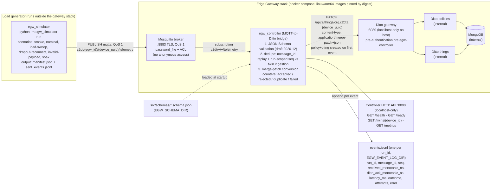
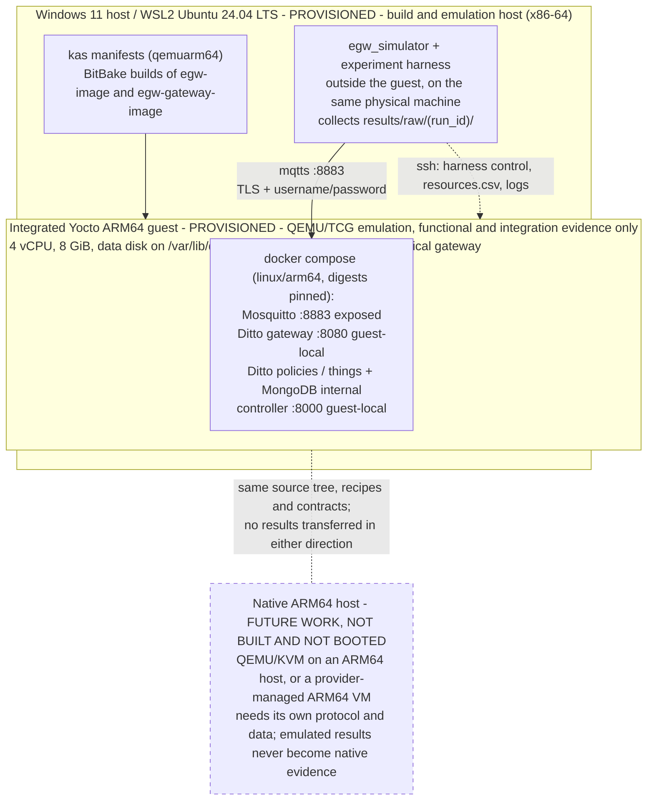

# EGW architecture diagrams

> **Plan v2.0 adopted 2026-09-18 (QEMU-only execution amendment).** The deployment diagram below records the **integrated emulated topology** of [the adopted plan](../docs/governance/INTEGRATED_DEVELOPMENT_PLAN_2026.md) and [ADR 0008](../docs/adr/0008-integrated-yocto-arm64-evaluation.md), whose status is *Accepted by the student for project execution (2026-09-18) — not agreed by the supervisors*. The separate-platform figure of plan v1.2 is historical: update the dissertation figures during the planned editorial revision and do not reuse the old deployment figure as the architecture of record. Drawing a component accepts no gate and admits no claim.

Sources of truth: the versioned
[`../docs/governance/INTEGRATED_DEVELOPMENT_PLAN_2026.md`](../docs/governance/INTEGRATED_DEVELOPMENT_PLAN_2026.md)
(normative, version 2.0 adopted 2026-09-18) and
[`../src/CONTRACTS.md`](../src/CONTRACTS.md) v1.1. These diagrams show only contracted
behaviour (topics, ports, endpoints, outcomes); they make no performance claims.

## 1. Logical component diagram

Plan section 3.3; CONTRACTS sections 1, 4, 5 and 8. The simulator is a load
generator external to the gateway stack; the controller is the MQTT-to-Ditto
bridge with mandatory JSON Schema validation and idempotent twin updates.



Notation: `(egw_id)` and `(device_uuid)` stand for the `{egw_id}` and
`{device_uuid}` placeholders of the CONTRACTS topic and thingId templates
(parentheses avoid Mermaid brace parsing).

## 2. Deployment diagram — the integrated emulated gateway (adopted plan v2.0, ADR 0008, CONTRACTS 8)

The system under test is one integrated system: the Yocto-produced ARM64 kernel
and root filesystem booted under QEMU/TCG on the existing x86-64 workstation,
with the container runtime and all six containers inside that guest. The
simulator and the experiment harness stay outside the guest, on the same
physical workstation. The environment is emulated, so it yields functional and
integration evidence only: a QEMU result never supports a performance or
security statement, and no measurement admissible for RQ3 has been taken.

**Provisioning state, read this with the diagram.** As of 2026-09-18 the WSL2
workstation and the emulated guest exist and have run the work shown: the image
was built, the guest booted, the six containers were deployed inside it and one
bounded end-to-end flow completed. The build, boot and isolated MongoDB records
are sealed under `docs/evidence/integrated-qemu/`; the first-flow record is
candidate evidence held outside the repository and unsealed. **There is no
native tier**: no native or burstable ARM64 instance exists, none is requested
by the adopted plan, and native deployment is documented, unverified future
work. Sealing is not acceptance, and drawing a component never upgrades its
evidence maturity.



Resource readings taken inside the guest or per container are recorded
separately from readings of the host QEMU process, and are never converted
between each other by an assumed emulation slowdown factor. The generator
shares the physical workstation with the emulator, so being outside the guest
does not establish physical resource isolation; the achieved load and that
contention are recorded with every run (risk R13).

Primary latency is measured inside the controller process in the emulated
guest, between MQTT receive and the Ditto 2xx acknowledgement
([`ADR 0005`](../docs/adr/0005-latency-measured-in-controller-monotonic.md);
[`CONTRACTS` §5](../src/CONTRACTS.md)). Values obtained there are informational
and labelled emulated; no measurement admissible for RQ3 has been taken, and
none will be under the adopted scope.

## 3. Sequence diagram — one telemetry event (accepted, duplicate and invalid branches)

Plan section 3.3; CONTRACTS sections 4-5.

```mermaid
sequenceDiagram
    autonumber
    participant SIM as egw_simulator (off-VM)
    participant MQ as Mosquitto :8883 (TLS, QoS 1)
    participant CT as egw_controller
    participant DT as Ditto gateway :8080
    participant DB as MongoDB (via policies/things)
    participant EL as events.jsonl

    SIM->>MQ: PUBLISH c2dt/(egw_id)/(device_uuid)/telemetry
    MQ-->>SIM: PUBACK (simulator records publish/puback ns in sent_events.jsonl)
    MQ->>CT: deliver message (subscription c2dt/+/+/telemetry)
    Note over CT: received_monotonic_ns = time.monotonic_ns()
    CT->>CT: JSON Schema validation (draft 2020-12, before any Ditto call)

    alt payload invalid
        CT->>EL: outcome=rejected (ditto_ack ns and latency_ms null)
    else duplicate: message_id already processed, or seq <= last_seq within the same run_id (CONTRACTS v1.1)
        Note over CT: dedupe state from twin ingestion feature;<br/>local cache rebuilt from twin after controller restart
        CT->>EL: outcome=duplicate (ditto_ack ns and latency_ms null)
    else valid and new
        opt first event for this device_uuid
            CT->>DT: create policy + thing org.c2dta:(device_uuid)
            DT->>DB: persist policy and thing
        end
        CT->>DT: PATCH /api/2/things/org.c2dta:(device_uuid) (merge-patch+json)
        Note over CT,DT: transient errors (timeout, 5xx): retry up to EGW_RETRY_MAX,<br/>exponential backoff base EGW_RETRY_BACKOFF_MS; 4xx not retried
        DT->>DB: persist feature update + ingestion (last_message_id, last_seq, last_run_id, last_ts, accepted_count)
        DT-->>CT: 2xx acknowledgement
        Note over CT: ditto_ack_monotonic_ns; latency_ms = (ack - received) / 1e6
        CT->>EL: outcome=accepted (latency_ms, attempts)
    end

    Note over CT,EL: exhausted retries or non-retryable errors are logged as outcome=failed
```
