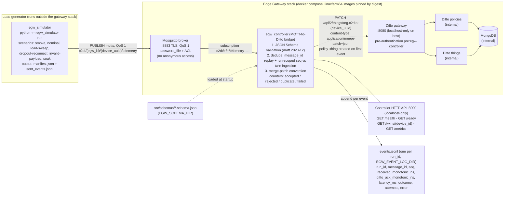
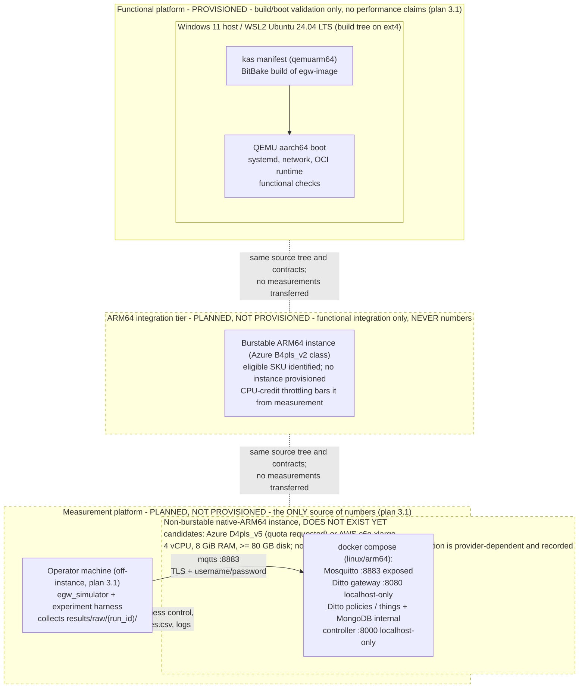

# EGW architecture diagrams

Sources of truth: the versioned
[`../docs/governance/INTEGRATED_DEVELOPMENT_PLAN_2026.md`](../docs/governance/INTEGRATED_DEVELOPMENT_PLAN_2026.md)
(normative) and [`../src/CONTRACTS.md`](../src/CONTRACTS.md) v1.1. These diagrams show only contracted
behaviour (topics, ports, endpoints, outcomes); they make no performance claims.

## 1. Logical component diagram

Plan section 3.3; CONTRACTS sections 1, 4, 5 and 8. The simulator is a load
generator external to the gateway stack; the controller is the MQTT-to-Ditto
bridge with mandatory JSON Schema validation and idempotent twin updates.



Notation: `(egw_id)` and `(device_uuid)` stand for the `{egw_id}` and
`{device_uuid}` placeholders of the CONTRACTS topic and thingId templates
(parentheses avoid Mermaid brace parsing).

## 2. Deployment diagram — three platform tiers (plan sections 3.1 and 5, ADR 0001, CONTRACTS 8)

The functional platform (WSL2 + QEMU) validates build, boot, systemd, network
and the OCI runtime only; no performance conclusions come from it, and a QEMU
result never supports a performance or security statement. Every measurement
must be taken on a non-burstable native-ARM64 instance, with the simulator running
off-instance so the external link is excluded from the controller-side latency
measurement.

**Provisioning state, read this with the diagram.** Only the functional tier
exists. The dashed subgraphs are **planned and not provisioned**: the
measurement instance **does not exist** (Oracle, Hetzner and Azure for Students
all failed to supply a non-burstable native ARM64 machine — risk R28), and the burstable
integration instance also **does not exist**; only an eligible burstable SKU
has been identified. They are drawn because they are
contracted by the plan, not because they are deployed; nothing in them has run.



Primary latency is measured inside the controller process on the measurement
instance, between MQTT receive and the Ditto 2xx acknowledgement (plan §3.1;
[`ADR 0005`](../docs/adr/0005-latency-measured-in-controller-monotonic.md);
[`CONTRACTS` §5](../src/CONTRACTS.md)). Until that instance exists, no such
measurement has been taken.

## 3. Sequence diagram — one telemetry event (accepted, duplicate and invalid branches)

Plan section 3.3; CONTRACTS sections 4-5.

```mermaid
sequenceDiagram
    autonumber
    participant SIM as egw_simulator (off-VM)
    participant MQ as Mosquitto :8883 (TLS, QoS 1)
    participant CT as egw_controller
    participant DT as Ditto gateway :8080
    participant DB as MongoDB (via policies/things)
    participant EL as events.jsonl

    SIM->>MQ: PUBLISH c2dt/(egw_id)/(device_uuid)/telemetry
    MQ-->>SIM: PUBACK (simulator records publish/puback ns in sent_events.jsonl)
    MQ->>CT: deliver message (subscription c2dt/+/+/telemetry)
    Note over CT: received_monotonic_ns = time.monotonic_ns()
    CT->>CT: JSON Schema validation (draft 2020-12, before any Ditto call)

    alt payload invalid
        CT->>EL: outcome=rejected (ditto_ack ns and latency_ms null)
    else duplicate: message_id already processed, or seq <= last_seq within the same run_id (CONTRACTS v1.1)
        Note over CT: dedupe state from twin ingestion feature;<br/>local cache rebuilt from twin after controller restart
        CT->>EL: outcome=duplicate (ditto_ack ns and latency_ms null)
    else valid and new
        opt first event for this device_uuid
            CT->>DT: create policy + thing org.c2dta:(device_uuid)
            DT->>DB: persist policy and thing
        end
        CT->>DT: PATCH /api/2/things/org.c2dta:(device_uuid) (merge-patch+json)
        Note over CT,DT: transient errors (timeout, 5xx): retry up to EGW_RETRY_MAX,<br/>exponential backoff base EGW_RETRY_BACKOFF_MS; 4xx not retried
        DT->>DB: persist feature update + ingestion (last_message_id, last_seq, last_run_id, last_ts, accepted_count)
        DT-->>CT: 2xx acknowledgement
        Note over CT: ditto_ack_monotonic_ns; latency_ms = (ack - received) / 1e6
        CT->>EL: outcome=accepted (latency_ms, attempts)
    end

    Note over CT,EL: exhausted retries or non-retryable errors are logged as outcome=failed
```
