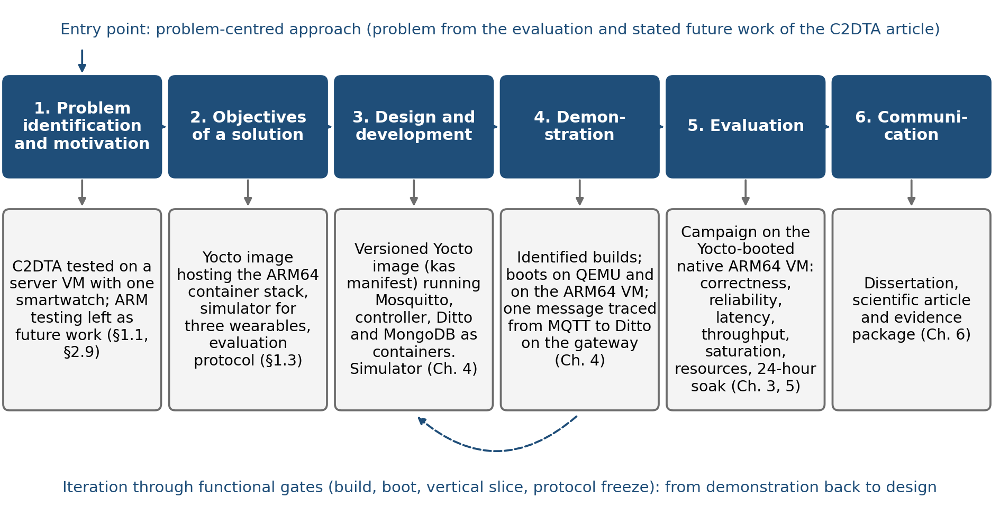

<!-- GENERATED FILE - DO NOT EDIT.
     Source: latex/chapters/01_introduction.tex
     Regenerate with: python thesis/tools/generate_sections.py
     The LaTeX tree under thesis/latex/ is the single edited source. -->

# Introduction

## Background and Motivation

*Edge computing* places computing and storage nodes at the edge of the Internet, close to the mobile devices and sensors that produce data \[1\], \[2\]. Low latency is one of the benefits because cloud data centers are not suitable for applications that need end-to-end delays below a few tens of milliseconds \[1\]. Sending every reading to the cloud also spends bandwidth and computing unnecessarily when the edge produces large quantities of data \[2\]. Privacy adds an additional reason, because the physical data that devices collect at the edge is usually private, as with wearable health devices\[2\]. In the smart home, the gateway is the edge between home devices and the cloud, and most of the data it gathers can stay inside the home\[2\].

Most wearable devices combine personal data with dependence on another device. Most data from wearable sensors are personal and uniquely represents the user and communicate over Bluetooth or Bluetooth Low Energy \[3\]. A *digital twin* is a software representation of an individual physical object that remains its virtual counterpart across the object's lifecycle \[4\]. There are three types of digital representation, a digital model has no automatic data exchange, a digital shadow receives a one-way flow from the physical object, and a digital twin exchanges data automatically in both directions \[5\]. Whoever hosts the twin of a wearable therefore receives its personal data.

The Consumer-Controlled Digital Twin Architecture (C2DTA) moves the digital twin of a smart device from a manufacturer-controlled cloud to an edge gateway under consumer control \[6\]. The gateway hosts the twin platform, and this shift makes consumers the *de facto* controllers of their smart-device data \[6\]. In its implementation, Eclipse Ditto manages the twins, and Eclipse Mosquitto carries sensor data, alongside Hyperledger Indy, Aries and Fabric and the InterPlanetary File System \[6\].

In this dissertation, the *local twin core* denotes the message broker, the controller and the twin platform that receive telemetry, validate it and keep twin state on the gateway. Within the sources examined, no evaluation covers a C2DTA-style local twin core on native ARM64 with concurrent telemetry from several wearable types under a pre-specified protocol. This dissertation builds and evaluates one integrated gateway. A versioned Yocto Project image supplies its Linux kernel and root filesystem and boots as the operating system of a native ARM64 virtual machine. On that system, a container stack materializes synthetic smartwatch, smart-ring and smart-clothing telemetry as twins in Eclipse Ditto. The same Yocto layers also produce a Quick Emulator (QEMU) target for functional checks, which run under processor emulation on the build host and yield no performance result.

## Research Questions

The research questions (RQs) address one of the four roles that the C2DTA assigns to its Edge Gateway: hosting the digital-twin platform\[6\]. RQ1 covers the versioned gateway image, its deployment and redeployment on an ARM64 virtual machine and the container stack that the image hosts. RQ2 and RQ3 belong to the evaluation of the integrated gateway on that virtual machine.

> **RQ1.** How can a version of Yocto-based ARM64 gateway image be built, deployed and redeployed in an ARM64 virtual machine to host the local digital-twin core of C2DTA?
>
> **RQ2.** To what extent can the integrated gateway ingest and materialize concurrent synthetic telemetry from three wearable-device types correctly and reliably, including under specified fault scenarios?
>
> **RQ3.** What latency, sustainable-throughput, saturation and per-container resource trade-offs characterize the integrated gateway under controlled loads on the selected ARM64 virtual machine?

Each question calls for a separate kind of evidence. For RQ1, the evidence comes from identified builds of the image and from its boots on QEMU and on the ARM64 virtual machine. Redeploying the container stack on that machine with digest-pinned Linux/arm64 images completes the evidence. RQ2 depends on a classified outcome for every message in the nominal, dropout-reconnect and invalid-payload scenarios. The load-sweep scenario targets sustainable throughput and saturation for RQ3, while controller-side latency and per-container processor and memory use complete its evidence.

## Objectives

The general objective is to design, build and experimentally evaluate an integrated, versioned Yocto-based ARM64 Edge Gateway that hosts the local digital-twin core of C2DTA. Five specific objectives decompose the general objective, two for the gateway and three for the evaluation and its evidence.

1.  Build a versioned Yocto Project image, with systemd, networking and a container runtime, that boots on QEMU for functional checks and on a native ARM64 virtual machine.

2.  Deploy, on the system booted from that image, an ARM64 container stack materializing validated Message Queuing Telemetry Transport (MQTT) messages as digital twins in Eclipse Ditto.

3.  Implement a command-line simulator for smartwatch, smart ring and smart clothing telemetry.

4.  Define test scenarios, from smoke test to 24-hour tests, and pre-specify the evaluation protocol of the campaign on the ARM64 virtual machine.

5.  Assemble a versioned evidence package with code, configurations, logs, data, checksums and the analysis script.

## Research Method

This dissertation applies the Design Science Research (DSR) methodology \[7\], whose practice rules require an artefact that addresses a problem and its rigorous evaluation. Its process model has six activities: problem identification and motivation, objectives of a solution, design and development, demonstration, evaluation and communication\[7\]. Research may enter this nominal sequence at any of its first four activities\[7\].

This work enters at the first activity, the problem-centered approach \[7\] that links to ideas arising from the future research suggested in a prior paper. The C2DTA article is that prior paper, and its evaluation and stated future work supply the idea for this dissertation \[6\]. Sections 1.1 and 2.9 set out the problem, Section 1.3 derives the objectives from it, and Section 2.1 gives the literature review method.

Figure 1.1 maps the six activities onto this work, which starts from the problem of Section 1.1. Design and development the ARM64 Yocto image, the container stack and its controller that run on the system booted from that image, and the deterministic telemetry simulator. Demonstration uses the artefact to solve instances of the problem \[7\]. In this work it repeats builds and boots of the image, on QEMU and on the ARM64 virtual machine. It also traces one message through the controller into Eclipse Ditto on the integrated gateway. The evaluation compares the observed results with the objectives \[7\], and communication includes this dissertation and the evidence package. Functional gates for build, boot, vertical slice and protocol freeze return the process from demonstration to design.

<figure id="fig:research-process" data-latex-placement="htbp">

<figcaption>Research process of this dissertation, instantiating the DSR methodology process model</figcaption>
</figure>

The evaluation runs under a pre-specified protocol on a temporary, non-burstable native ARM64 virtual machine that boots the Yocto-built kernel and root filesystem. Emulated boots on QEMU serve functional checks only, and a result on the ARM64 virtual machine characterizes that platform configuration. The run is the statistical unit, and the controller measures latency on a monotonic clock, from reception to the Ditto acknowledgement. Chapter 3 selects the platform and details the protocol and its statistical treatment.

## Document Structure

After this introduction, Chapter 2 sets out the theoretical framework, and Section 2.1 describes the literature review method. The methodology of Chapter 3 selects the evaluation platform and defines the protocol, the scenarios, the metrics with their operational definitions and the statistical treatment. Chapter 4 describes the architecture and implementation: the Yocto image and its targets, the container stack, the message and interface contracts, the simulator and the controller.

The evaluation and its results form Chapter 5. Chapter 6 draws the conclusions and identifies future work.
